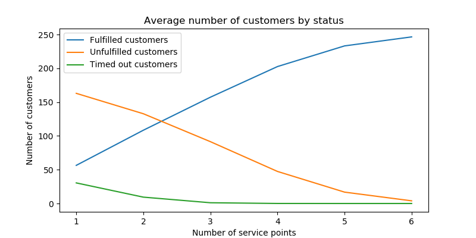

# Post office queue simulation

This was a coursework project for a module titled The C Family in my computer science degree. The task was to simulate a
post office queue using random number distributions. The parameters of the simulation are controlled by an input file,
and the output of the simulation in written to an output file. This work was graded 92% by the university.

To compile and link the program, run

```shell
>    ./compileSim
```

To run the program:

```shell
>    ./simQ testInput.txt 1000 outFile.txt
```

Output will be saved to `outFile.txt`

## Experimentation

Another part of the project was to use this simulation to run experiments with different parameters, and investigate the
optimum number of service points for a post office, depending on certain parameters.

I ran simulations with the following input file parameters:

```
maxQueueLength      10
# change numServicePoints each simulation
numServicePoints    3
closingTime         100
averageNewCustomersPerInterval  3
averageServeTime                2
averageToleranceToWaiting       15
```

And changed `numServicePoints` to see what effect it would have on the number of customers that left the queue because
they got bored of waiting.

These were the results:


I discovered that the number of service points should be roughly equal to the number of customers that arrive each
interval (on average)
multiplied by the average time to serve a customer.

More details about this project and the experiment can be found in the [PDF report](PostOfficeReport.pdf)

Please feel free to download the code and run your own experiments with different input parameters, and if you notice
any bugs in the code, you can raise an issue on the GitHub page